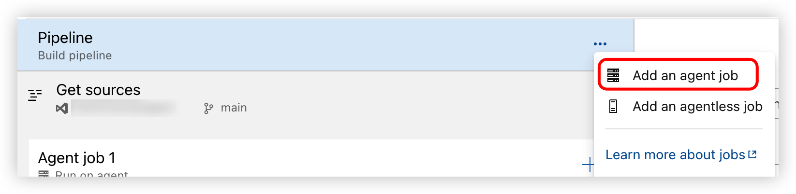
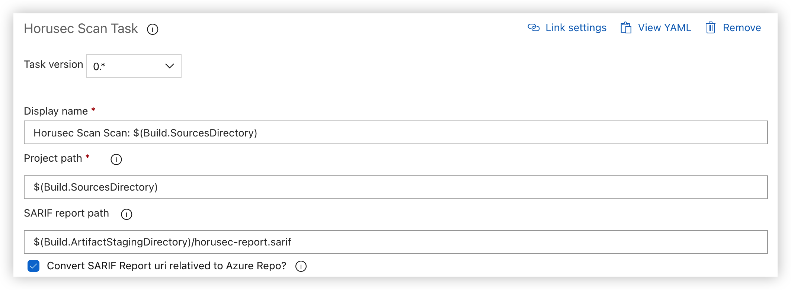
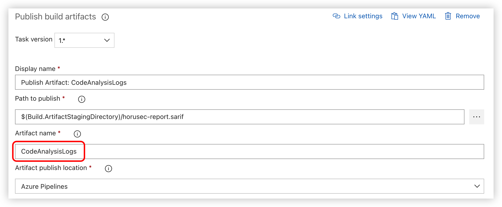
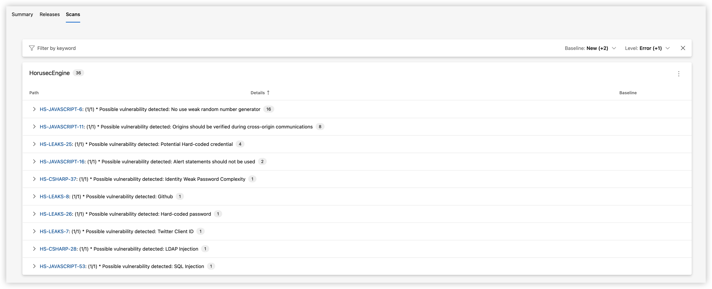

Horusec Scan Task
===

[English Doc](https://github.com/wellwind/azuredevops-extension-horusec-scan/blob/main/README.md) | [中文說明](https://github.com/wellwind/azuredevops-extension-horusec-scan/blob/main/README.zh-TW.md)

Add the [Horusec](https://horusec.io/site/) scan results to the pipeline. Horusec is an open source tool that performs static code analysis to identify security flaws.

Agent Pool
---

It is recommended to use a Linux agent pool (e.g. `ubuntu-latest`).

Windows agent pool can also be used, but it may encounter some container issues and may not be able to use all the tools for scanning.

If you are currently using a Windows agent, you can add a new Linux agent job:



for YAML reference:

```yaml
jobs:
  - job:
    displayName: 'Windows Job: Build Validation'
      pool:
        vmImage: windows-latest
  - job:
      displayName: 'Linux Job: Horusec Scan'
      pool:
        vmImage: ubuntu-latest
      steps:
        - task: MikeHuang.horusec-scan-task.horusec-scan-task.herusec-scan@0
          displayName: 'Horusec Scan Scan: $(Build.SourcesDirectory)'
          inputs:
            projectPath: '$(Build.SourcesDirectory)'
            sarifReportPath: '$(Build.ArtifactStagingDirectory)/horusec-report.sarif'
            sarifPathConvert: true
        - task: PublishBuildArtifacts@1
          displayName: 'Publish Artifact: CodeAnalysisLogs'
          inputs:
            PathtoPublish: '$(Build.ArtifactStagingDirectory)/horusec-report.sarif'
            ArtifactName: CodeAnalysisLogs
```

Report
---

If you use the default options, the Herusec scan result will be displayed as text in the console.

If you want to output as a [SARIF](https://sarifweb.azurewebsites.net/) report, you can specify the `sarifReportPath` path.

The generated SARIF file will only contain the path of the scanned file by default. You can check the `sarifPathConvert` option to convert the path to the corresponding path in the Azure Repo.



We recommended to install the [SARIF SAST Scans Tab](https://marketplace.visualstudio.com/items?itemName=sariftools.scans) extension to view the SARIF report. Just publish the artifact with the Artifact name `CodeAnalysisLogs`.



You can then see the scan results in the `Scan` tab.



Related Links
---

* Horusec: <https://horusec.io/site/>
* SARIF SAST Scans Tab: <https://marketplace.visualstudio.com/items?itemName=sariftools.scans>
* Extension Icon From: [FlatIcon](https://www.flaticon.com/free-icons/shield)
