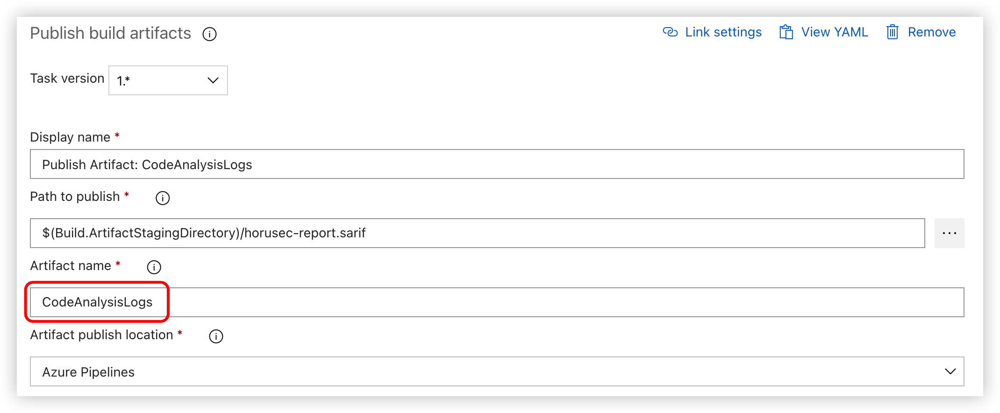

Horusec Scan Task
===

[English Doc](https://github.com/wellwind/azuredevops-extension-horusec-scan/blob/main/README.md) | [中文說明](https://github.com/wellwind/azuredevops-extension-horusec-scan/blob/main/README.zh-TW.md)

Add the [Horusec](https://horusec.io/site/) scan results to the pipeline. Horusec is an open source tool that performs static code analysis to identify security flaws.

Agent Pool
---

建議使用 Linux 的 agent pool，如 `ubuntu-latest`。

Windows 的 agnet pool 也可以用，但會遇到一些 container 問題，沒辦法使用所有的工具進行掃描。

如果你目前已經使用 Windows 的 agent 了，你可以新增一個新的 Linux agent job：


YAML 參考：

```yaml
jobs:
  - job:
    displayName: 'Windows Job: Build Validation'
      pool:
        vmImage: windows-latest
  - job:
      displayName: 'Linux Job: Horusec Scan'
      pool:
        vmImage: ubuntu-latest
      steps:
        - task: MikeHuang.horusec-scan-task.horusec-scan-task.herusec-scan@0
          displayName: 'Horusec Scan Scan: $(Build.SourcesDirectory)'
          inputs:
            projectPath: '$(Build.SourcesDirectory)'
            sarifReportPath: '$(Build.ArtifactStagingDirectory)/horusec-report.sarif'
            sarifPathConvert: true
        - task: PublishBuildArtifacts@1
          displayName: 'Publish Artifact: CodeAnalysisLogs'
          inputs:
            PathtoPublish: '$(Build.ArtifactStagingDirectory)/horusec-report.sarif'
            ArtifactName: CodeAnalysisLogs
```

輸出報表
---

若使用預設的選項，會將掃描結果以文字的方式輸出 console 上，如果你希望輸出成 [SARIF](https://sarifweb.azurewebsites.net/) 報表，你可以指定 `sarifReportPath` 路徑

產出的 sarif 檔案預設只會包含掃描出的檔案路徑，你可以勾選 `sarifPathConvert` 來將路徑轉換成對應 Azure Repo 的路徑


推薦安裝 [SARIF SAST Scans Tab](https://marketplace.visualstudio.com/items?itemName=sariftools.scans) 套件來檢視 SARIF 報表，只要輸出名為 `CodeAnalysisLogs` 的 artifact 即可



接著你就可以在 `Scan` 頁籤看到掃描結果了


Related Links
---

* Horusec: <https://horusec.io/site/>
* SARIF SAST Scans Tab: <https://marketplace.visualstudio.com/items?itemName=sariftools.scans>
* Extension Icon From: [FlatIcon](https://www.flaticon.com/free-icons/shield)
